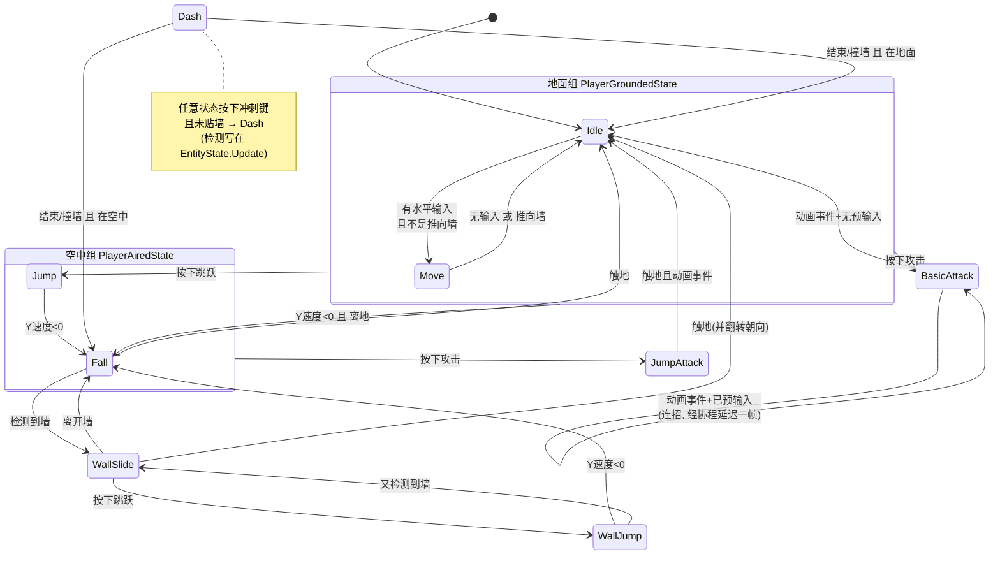
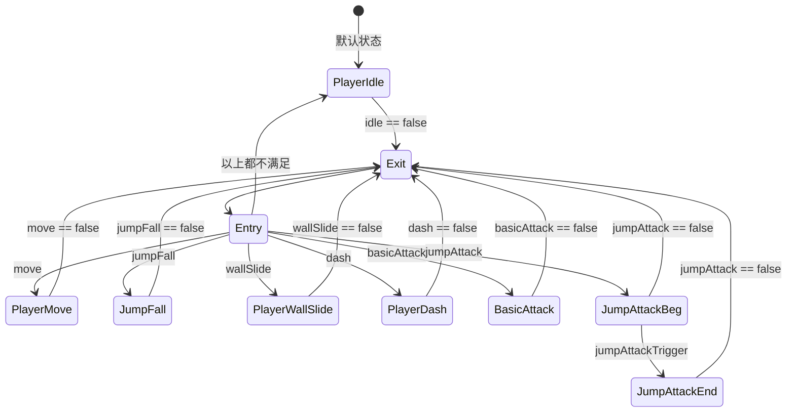
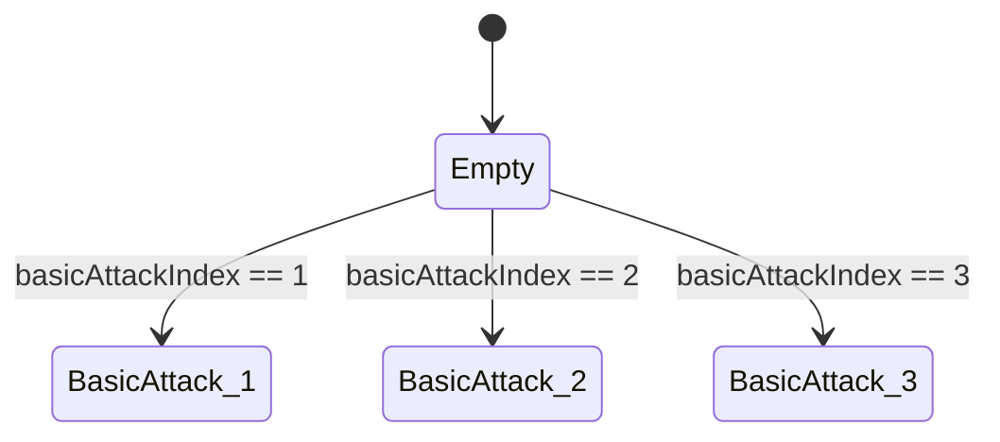

# Player 状态机拓扑

> 本文档描述 `Michael` 玩家角色的状态流转,由两套独立的状态机耦合而成。
> 源码:[Assets/Scripts/Michael](../Scripts/Michael) · 动画:[Assets/Animations/PlayerAnimController.controller](../Animations/PlayerAnimController.controller)

---

## 1. 两层状态机

角色的行为由**两套状态机**共同决定,它们不是一一对应的关系:

| | 逻辑状态机(C#) | 动画状态机(Animator) |
|---|---|---|
| 位置 | `StateMachine` + `EntityState` 派生类 | `PlayerAnimController` |
| 驱动 | `Player.Update()` 每帧调 `currentState.Update()` | Unity 内部按参数求值 |
| 职责 | 输入判定、速度计算、状态切换 | 播哪个 clip、clip 之间怎么过渡 |
| 数据 | `Rigidbody2D` 速度、碰撞检测标志 | 10 个 Animator 参数 |

**耦合点只有一个**:每个 C# 状态在构造时绑定一个 `conditionName`,`Enter()` 把它置 `true`、`Exit()` 置 `false`。动画状态机看到参数变化后自行切换。

```
逻辑状态          conditionName        动画状态
─────────────────────────────────────────────────────
IdleState         "idle"          →   PlayerIdle
MoveState         "move"          →   PlayerMove
JumpState         "jumpFall"      ┐
FallState         "jumpFall"      ├→  Jump/Fall (混合树, 按 yVelocity)
WallJumpState     "jumpFall"      ┘
WallSlideState    "wallSlide"     →   PlayerWallSlide
DashState         "dash"          →   PlayerDash
BasicAttackState  "basicAttack"   →   BasicAttack 子状态机 (按 basicAttackIndex 选 1/2/3)
JumpAttackState   "jumpAttack"    →   PlayerJumpAttackBeg → PlayerJumpAttackEnd
```

> **注意三个逻辑状态共用 `jumpFall`**。Jump / Fall / WallJump 在动画层是同一个状态,靠混合树里的
> `yVelocity` 参数在"上升"和"下降"两个 clip 之间插值,而不是靠切换动画状态。

---

## 2. 逻辑状态机拓扑



### 继承关系

```
EntityState                     持有冲刺检测, 所有状态都继承到
├── PlayerGroundedState         地面共性: 掉落 / 跳跃 / 普攻
│   ├── PlayerIdleState
│   └── PlayerMoveState
├── PlayerAiredState            空中共性: 空中横向控制 / 跳跃攻击
│   ├── PlayerJumpState
│   └── PlayerFallState
├── PlayerWallSlideState
├── PlayerWallJumpState
├── PlayerDashState
├── PlayerBasicAttackState
└── PlayerJumpAttackState
```

**继承即能力**:一个状态能做什么,取决于它继承自谁。`WallSlideState` 直接继承 `EntityState`,
所以贴墙时既不能普攻也没有空中横向控制——这是继承结构决定的,不是哪里写了判断。

---

## 3. 转换条件明细

| 从 | 到 | 触发条件 | 代码位置 |
|---|---|---|---|
| Idle | Move | `MoveInputValue.x != 0` 且 非"推向墙" | `PlayerIdleState.Update` |
| Move | Idle | `x == 0` 或 (`WallDetected` 且 推向墙) | `PlayerMoveState.Update` |
| 地面组 | Fall | `linearVelocityY < 0` 且 `!GroundDetected` | `PlayerGroundedState.Update` |
| 地面组 | Jump | `Jump.WasPerformedThisFrame()` | `PlayerGroundedState.Update` |
| 地面组 | BasicAttack | `Attack.WasPerformedThisFrame()` | `PlayerGroundedState.Update` |
| Jump | Fall | `linearVelocityY < 0` 且 当前不是 JumpAttack | `PlayerJumpState.Update` |
| 空中组 | JumpAttack | `Attack.WasPressedThisFrame()` | `PlayerAiredState.Update` |
| Fall | Idle | `GroundDetected` | `PlayerFallState.Update` |
| Fall | WallSlide | `WallDetected` | `PlayerFallState.Update` |
| WallSlide | WallJump | `Jump.WasPerformedThisFrame()` | `PlayerWallSlideState.Update` |
| WallSlide | Fall | `!WallDetected` | `PlayerWallSlideState.Update` |
| WallSlide | Idle | `GroundDetected`,并调 `Flip()` 转身 | `PlayerWallSlideState.Update` |
| WallJump | Fall | `linearVelocityY < 0` | `PlayerWallJumpState.Update` |
| WallJump | WallSlide | `WallDetected` | `PlayerWallJumpState.Update` |
| Dash | Idle / Fall | 计时结束 或 撞墙,按是否触地二选一 | `PlayerDashState.Update` |
| BasicAttack | 自身 / Idle | 动画事件 `triggerCalled` 到达时,看有无预输入 | `PlayerBasicAttackState.Update` |
| JumpAttack | Idle | `GroundDetected` 且 `triggerCalled` | `PlayerJumpAttackState.Update` |
| **任意状态** | Dash | `Dash.WasPressedThisFrame()` 且 `!WallDetected` | `EntityState.Update` |

---

## 4. 动画状态机拓扑

动画层用的是**"Exit + Entry 重新路由"**的写法,而不是状态之间两两连线:



**每个状态只有一条出边:自己的 bool 变 false 就去 Exit。** Exit 回到 Entry,Entry 按上表顺序
挑第一个为真的参数进入对应状态,都不满足就落到默认的 `PlayerIdle`。

这样做的好处是加新状态时不用给每个已有状态补连线,只需加一条 Entry 分支。代价是
**Entry 分支的顺序即优先级**,同时有多个 bool 为真时,靠前的赢。

### BasicAttack 子状态机



三段连招是**同一个逻辑状态**(`BasicAttackState`)配**三个动画 clip**。段数由 C# 侧的
`comboIndex` 决定,通过 `anim.SetInteger("basicAttackIndex", comboIndex)` 传给动画层。

### Jump/Fall 混合树

`Jump/Fall` 状态挂的是一个 1D 混合树,参数是 `yVelocity`:

```
阈值 -1  →  PlayerFall.anim
阈值 +1  →  PlayerJump.anim
```

`EntityState.Update()` 每帧执行 `anim.SetFloat("yVelocity", rb.linearVelocityY)`。
上升时为正播起跳、下降时为负播下落,中间自动插值。

---

## 5. 关键机制

### 5.1 动画事件回调

攻击类状态需要知道"动画播到哪了",走的是 Unity 动画事件:

```
动画 clip 上的 Event
  → PlayerAnimationTriggers.CurrentStateTrigger()   (挂在带 Animator 的子物体上)
  → Player.CallAnimationTrigger()
  → stateMachine.currentState.CallAnimationTrigger()
  → 当前状态的 triggerCalled = true
```

`triggerCalled` 在 `EntityState.Enter()` 里重置,所以每次进入状态都是干净的。

### 5.2 连招的预输入

`BasicAttackState` 用 `comboAttackQueued` 记录"玩家在动画中途按过攻击键":

1. `Enter()` 清空队列
2. `Update()` 里检测到攻击键按下 → 若 `comboIndex < ComboLimit` 则置队列为真
3. 动画事件到达 → 有队列就走连招,没有就回 Idle

连招不是直接 `ChangeState`,而是先把 `basicAttack` 置 false 让动画层退出,
再经 `Player.EnterAttackStateWithDelay()` 的协程等到 `WaitForEndOfFrame` 才真正切换——
这样动画层能重新进入并播放下一段 clip。

### 5.3 碰撞检测

`Player.Update()` 在调用状态 `Update()` **之前**先跑 `UpdateCollisionDetection()`,
所以一帧之内所有状态看到的是同一份检测结果:

| 标志 | 射线 |
|---|---|
| `GroundDetected` | 从 `transform.position` 向下,长度 `checkGroundDistance` |
| `WallDetected` | 上下两条,从 `WallRayUp()` / `WallRayDown()` 朝 `FaceDirection`,任一命中即为真 |

**`WallDetected` 是"朝向相关"的**:射线方向取自 `FaceDirection`,所以它只能告诉你
"面前有没有墙",背后的墙探测不到。所有消费它的地方都必须考虑这一点。

### 5.4 朝向翻转

朝向**只在 `Player.SetVelocity()` 内部翻转**——`UpdateDirection(x)` 发现 x 的符号与
当前朝向相反时调 `Flip()`。这意味着:

- 任何设置速度的操作都可能顺带改变朝向
- 不调 `SetVelocity` 就永远不会转身

`WallSlideState` 落地时额外手工调了一次 `Flip()`,让角色背对墙面站立。

---

## 6. 已知陷阱

### 6.1 `ChangeState` 之后必须 return

`StateMachine.ChangeState` 是**同步**的:调用返回时 `currentState` 已经换人、新状态的
`Enter()` 也已执行完。但**调用方的代码会继续往下跑**。

尤其注意 `base.Update()`:基类里的 `ChangeState` + `return` 只结束基类方法,派生类的
`Update()` 会从 `base.Update()` 的下一行继续执行。所以派生类需要:

```csharp
base.Update();

if (stateMachine.currentState != this)
{
    return;
}
```

漏掉这个守卫的典型症状是"按住方向键跳不起来"——基类切到了 Jump,派生类又切成了 Move。

### 6.2 冲刺检测写在 `EntityState` 里

`EntityState.Update()` 里的冲刺检测意味着**所有状态都无条件具备冲刺能力**,包括
`DashState` 自己。连点冲刺键会重入 `DashState`,每次 `Enter()` 重置 `stateTimer`,
形成无限冲刺。`CanDash()` 目前只挡贴墙。

要根治得把这段检测下移到 `PlayerGroundedState` + `PlayerAiredState`,让"能不能冲刺"
成为明确的能力归属。

### 6.3 新增序列化字段不会自动生效

给已经放进场景的 `Player` 组件新增 `public` 字段时,**代码里的初始化值对现有实例无效**。
Unity 从场景数据反序列化,数据里没有该字段就取 `default(T)`——数值是 0、数组是 null。

历史上踩过:`WallJumpForce` 是 `(0,0)` 导致墙跳完全没有位移,排查了很久才发现代码逻辑
从头到尾都是对的。**每次加字段都回 Inspector 确认一眼实际值。**

### 6.4 浮点数不要比相等

判断"输入方向与朝向是否一致"时用 `x * FaceDirection > 0`,不要用 `x == FaceDirection`。
键盘给的是精确的 ±1 能对上,手柄摇杆给 0.98 这类模拟量就永远不成立,保护会静默失效。

---

## 7. 可调参数

| 参数 | 默认 | 作用 |
|---|---|---|
| `MoveSpeed` | 5 | 地面移动速度 |
| `JumpForce` | 16 | 起跳初速度 |
| `WallJumpForce` | (5, 12) | 墙跳速度,x 方向自动取背离墙的一侧 |
| `InAirMoveMultiplier` | 0.7 | 空中横向控制衰减 |
| `WallSlideSlowMultiplier` | 0.5 | 贴墙下滑的减速系数 |
| `DashDuration` / `DashSpeed` | 0.15 / 20 | 冲刺时长与速度 |
| `AttackVelocity[3]` | (3,1.5) (1,2) (5,1.5) | 三段普攻各自的前冲速度 |
| `JumpAttackVelocity` | (5, 6) | 跳跃攻击的初速度 |
| `AttackVelocityDuration` | 0.1 | 攻击前冲持续时间,之后水平速度归零 |
| `ComboResetTime` | 1 | 超过这个间隔不再续连招,回到第一段 |
| `checkGroundDistance` | 1.45 | 地面射线长度(胶囊底部约在 -1.33) |
| `checkWallDistance` | 0.55 | 墙体射线长度 |
| `checkWallUpOffset` / `DownOffset` | 0.3 / 1.0 | 两条墙体射线的垂直偏移 |
