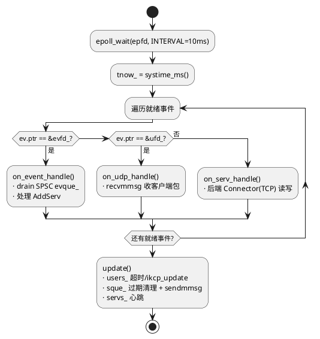
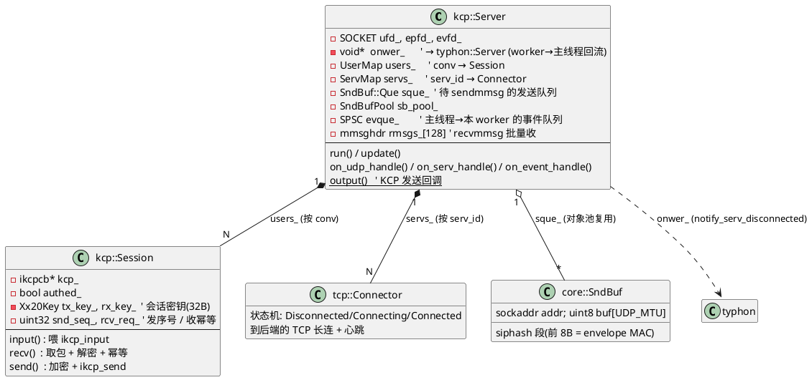
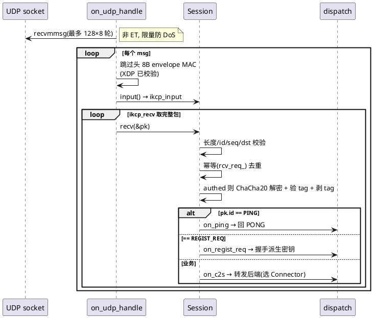
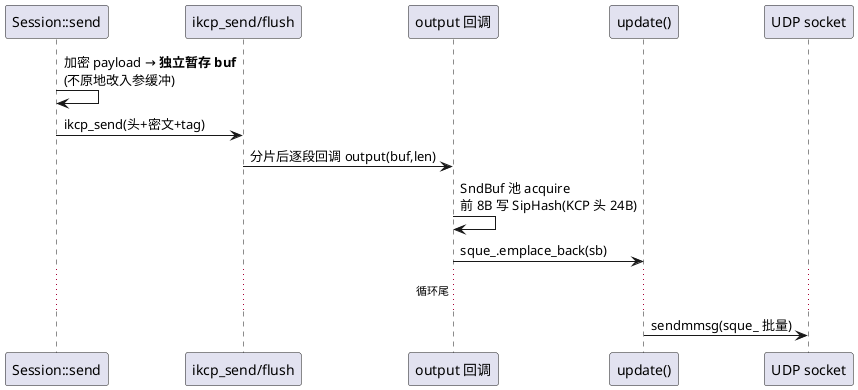
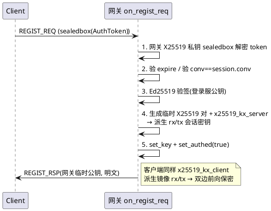

# `kcp::Server` — 网关 worker

> 网关侧 UDP/KCP 终结点。[typhon::Server](typhon_server.md) 起 N 个(≈核数-1),每个独占**一条线程 + 一个 `SO_REUSEPORT` UDP socket**;eBPF 按 KCP `conv` 路由,同 `conv` 永远落同一个 worker → **share-nothing,全程无锁**。
> 源码:[include/kcp/server.hpp](../include/kcp/server.hpp) · [src/kcp/server.cpp](../src/kcp/server.cpp)

---

## 1. 线程模型与 epoll

单线程 `run()` 跑一个 `epoll_wait`,盯三类 fd,循环尾统一 `update()` 推 KCP:

| fd | 触发模式 | 用途 |
|---|---|---|
| `ufd_`(UDP) | **故意非 ET** | recvmmsg 限量收包;有残留下轮再唤醒 → 防攻击者大量发包 DoS 把 worker 钉死 |
| `evfd_`(eventfd) | ET | typhon 主线程经 SPSC `evque_` 投递 `AddServ`,敲此 fd 唤醒 |
| serv fd(后端 TCP) | ET | `Connector` 的连接进度 / 收包 |

---

## 2. 核心数据结构

---

## 3. 收包路径(客户端 → 网关)

XDP 在内核已校验 envelope MAC,userland **不重复校验**,直接偏移 8B 喂 ikcp:

- `on_c2s` **零拷贝转发**:收包时 body 落在 `rbuf + PKX_HDR_LEN`(预留 10B),转发时原地在前面填 `PackageEx` 头(`src_id = conv`)再复用 `Connector::send`,不复制 payload。
- 协议错(解密失败/越界)→ `remove_session`;后端找不到/写失败**不踢**客户端 session。

---

## 4. 发包路径(网关 → 客户端)

KCP 分片后经 `output` 回调落 `SndBuf` 池,加 SipHash envelope MAC,`update()` 末尾 `sendmmsg` 批量发:

---

## 5. 鉴权握手(`on_regist_req`)

---

## 6. `update()` 周期(每轮 epoll 尾)

三件事,全量但顺序执行(单线程):

1. **session 超时 + KCP tick**:遍历 `users_`,超时(`check_timeout`)则摘除 + `on_disconnected`,否则 `ikcp_update` 推进重传/ACK/flush。
2. **发送队列出网卡**:`sque_` 前段过期的 `SndBuf` 直接释放(不发),其余 `sendmmsg` 批量发,合并成一次 erase。
3. **后端心跳/判死**:遍历 `servs_`,`Connector::update` 发 PING / 判死;判死摘除 + 经 `onwer_->notify_serv_disconnected` 经 **pipe 回流**通知主线程(详见 [typhon_server.md](typhon_server.md))。

---

## 7. 后端连接(`on_serv_handle`)

`servs_` 里每个 `Connector` 是到一个后端 instance 的 TCP 长连:
- `EPOLLOUT` + `Connecting` → `getsockopt(SO_ERROR)` 确认连上 → `regist()` 发 REGIST_REQ。
- `EPOLLIN` → 读 TCP 流 → `decode` 切 `PackageEx` → `on_pong` / `on_regist_rsp` / **`on_s2c`**(后端回程 → 查 session 回发客户端)。
- `EPOLLERR/HUP` → `remove_serv`(摘除 + pipe 回流通知主线程重连)。
