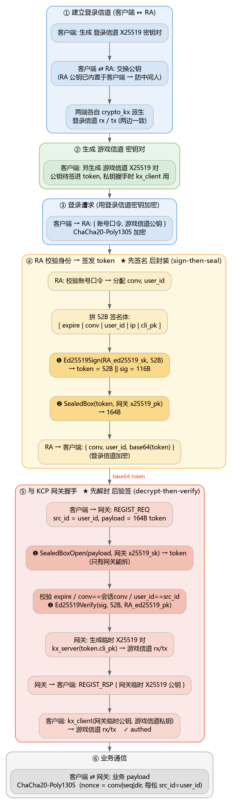

# 登录鉴权流程

## 1. 总览

登录的本质是:**客户端先在一条受保护的信道里向登录服(RA)证明身份,RA 发一张
只有网关能拆、且确认是 RA 签发的"通行证"(token);客户端拿这张 token 去和网关
握手,网关据此为这条游戏连接派生会话密钥。**

整条链路存在 **两条独立的加密信道**,各自有一对收发密钥(rx/tx):

| 信道 | 两端 | 密钥来源 | 作用 |
|---|---|---|---|
| **登录信道** | 客户端 ↔ RA | 客户端与 RA 做 X25519 ECDH(`crypto_kx`)派生 | 加密登录请求/响应(账号口令、token 等) |
| **游戏信道** | 客户端 ↔ KCP 网关 | 握手时 ECDH 派生(token 里带客户端公钥) | 加密 KCP 之上的业务 payload(ChaCha20-Poly1305) |

> 客户端因此需要 **两对 X25519 密钥对**:一对用于登录信道,一对用于游戏信道
> (后者的公钥被 RA 签进 token,私钥在和网关握手时做 `kx_client`)。

角色:

- **客户端** — 发起登录、之后连网关。
- **RA(登录服)** — HTTP 服务;校验身份、签发 token。持有 RA 的 `ed25519_sk`(签名)
  和网关的 `x25519_pk`(封装 token)。
- **KCP 网关** — 持有自己的 `x25519_sk`(拆封 token)和 RA 的 `ed25519_pk`(验签)。

---

## 2. 时序图



---

## 3. 分步详解

### ① 建立登录信道(客户端 ↔ RA)
客户端生成一对 X25519 密钥(登录信道用),与 RA 交换公钥后,**两端各自用
`crypto_kx` 从同一个 ECDH 共享秘密派生出同一对 rx/tx**(BLAKE2b-512 派生,
client 的 `tx` == RA 的 `rx`)。注意 rx/tx 不是客户端"独立生成"的,是交换后派生的。

> **信任根**:RA 的 X25519 公钥必须**内置在客户端**(像网关公钥那样),否则中间人
> 换掉 RA 公钥即可冒充 RA。或者 RA 直接走 HTTPS,则这层手工 ECDH 可省。

### ② 生成游戏信道密钥对
客户端**另外**再生成一对 X25519 密钥(游戏信道用):公钥 `cPk_gw` 待会儿发给 RA
签进 token;私钥 `cSk_gw` 留着和网关握手时做 `kx_client`。

### ③ 登录请求
客户端把 `{账号口令, cPk_gw}` 用**登录信道**的 tx 密钥 ChaCha20-Poly1305 加密后发给 RA。

### ④ RA 签发 token(关键:sign-then-seal)
RA 校验身份通过后:
1. 分配本次连接的 `conv` 和 `user_id`;
2. 拼 **52 字节**签名体:`expire(8) | conv(4) | user_id(4) | ip(4) | cli_pk(32)`(小端);
3. **先签名**:`sig = Ed25519Sign(RA_ed25519_sk, 这52字节)` → 64 字节;
4. 拼成完整 token:`52B || sig` = **116 字节**;
5. **再封装**:`sealed = SealedBoxEncrypt(token, 网关 x25519_pk)` → **164 字节**;
6. 把 `{ conv, user_id, base64(sealed) }` 用登录信道加密回给客户端。

> ⚠️ **顺序必须是 sign-then-seal(签名在密封内部)**。因为网关是"先解封、再验签"
> (见 ⑤):它先用自己的 `x25519_sk` 拆封拿到 token,再对 token 前 52 字节验签。
> 签名若放在密封外面,网关这套验证就对不上。
>
> ⚠️ **RA 必须连 `conv` 一起返回**。网关会校验 `token.conv == 会话 conv`,而
> `conv` 是客户端连网关时用的 KCP conv —— 客户端得知道用哪个。
>
> ⚠️ **expire 设短**。这是"立即拿去连网关"的一次性票,几分钟有效期即可。

### ⑤ 和网关握手
客户端把 `base64(sealed)` 解出 164 字节,作为 `REGIST_REQ` 的 payload 发给网关,
Package 头里 `src_id = user_id`。网关:
1. `SealedBoxOpen(payload, 网关 x25519_sk)` → 116 字节 token(**只有网关能拆**);
2. 校验 `expire`、`conv == 会话 conv`、`user_id == Package.src_id`;
3. `Ed25519Verify(sig, 前52字节, RA_ed25519_pk)`(**确认是 RA 签发**);
4. 生成网关侧临时 X25519 对,`kx_server(token.cli_pk)` → 游戏信道 rx/tx;
5. 回 `REGIST_RSP`,payload = 网关临时 X25519 公钥(明文,客户端此刻还没密钥)。

客户端收到 RSP 后 `kx_client(网关临时公钥, cSk_gw)` → 派生出同一对游戏信道 rx/tx,
握手完成(authed)。

### ⑥ 业务通信
握手完成后加密**不在 payload 这一层**,而是下沉到 KCP 之外的**信封层** —— 整个 KCP
数据报(含它自己的 24B 头)被 ChaCha20-Poly1305 裹住,`conv` 与计数器放在 AAD 里。
nonce 由信封的**计数器**承担(每次发送 +1,含重传与纯 ACK),它同时也是防重放序号,
收端用 RFC 6479 式 64 位滑动窗口去重。布局见 [package.md](package.md#5-加密不在这一层)。

> 早期版本是"头明文 + 只加密 payload + `seq` 当 nonce",**已废弃**。原因是认证发生在
> 错误的层:KCP 头裸露在外,同槽客户端能伪造受害者的 `sn`/`una`/`rmt_wnd`。

每个包仍带 `src_id = user_id`,网关**逐包校验** `src_id == session.uid`
(见 [worker.cpp](../Adam/src/kcp/worker.cpp) 里 `authed()` 之后那道 `src_id` 伪造检查)。

---

## 4. Token 结构

封装前的明文 token(116 字节,**小端 raw struct**,与 C++ `core::Token` 一致):

```
偏移  长度  字段
  0     8   expire     过期时间戳(秒)
  8     4   conv       KCP conv(RA 分配)
 12     4   user_id    用户 ID
 16     4   ip         登录 IP(IPv4)
 20    32   cli_pk     客户端"游戏信道"X25519 公钥
 ----  ---  ----------------------------------------  ↑ 前 52 字节为签名体
 52    64   sign       Ed25519 签名(覆盖前 52 字节)
```

`SealedBoxEncrypt` 后 = `116 + 48` = **164 字节**(`crypto_box_SEALBYTES = 临时公钥32 + MAC16`),
即 `REGIST_REQ` 的 payload 长度(网关 `REGIST_REQ_LEN = sizeof(Token) + 48`)。

---

## 5. 密钥清单(谁持有什么)

| 密钥 | RA | 网关 | 客户端 | 用途 |
|---|:--:|:--:|:--:|---|
| RA `ed25519_sk` | ✅ | | | 签 token |
| RA `ed25519_pk` | | ✅ | (内置) | 验 token 签名 |
| 网关 `x25519_pk` | ✅ | ✅ | (内置) | 封装 token / 客户端内置作信任根 |
| 网关 `x25519_sk` | | ✅ | | 拆封 token |
| RA `x25519_pk` | ✅ | | (内置) | 登录信道 ECDH(客户端内置防中间人) |
| 客户端登录信道 X25519 对 | | | ✅ | 登录信道 ECDH |
| 客户端游戏信道 X25519 对 | | | ✅ | 公钥进 token;私钥握手 `kx_client` |

---

## 6. 实现对照

> **RA 就是 Eva**(Go 登录服),下面按实际路径列。

- Eva 的密码学原语在 [`Eva/utils/cryptor.go`](../Eva/utils/cryptor.go)(纯 Go `x/crypto`,与 libsodium 逐字节兼容)。
- Eva 发牌 = `Ed25519Sign` + `SealedBoxEncrypt`(顺序见 ④),在 [`Eva/com/token.go`](../Eva/com/token.go);
  `conv` 的分配在 [`Eva/com/kcp.ex.go`](../Eva/com/kcp.ex.go) 的 `MakeConv`。
- 网关握手校验在 [`Adam/src/kcp/worker.cpp`](../Adam/src/kcp/worker.cpp) 的 **`on_regist_terminal_req`**
  (旧名 `on_regist_req`,且已从 `server.cpp` 挪到 `worker.cpp`)。
- 客户端参考实现:C# [`Lilith/Lilith`](../Lilith/Lilith)。
