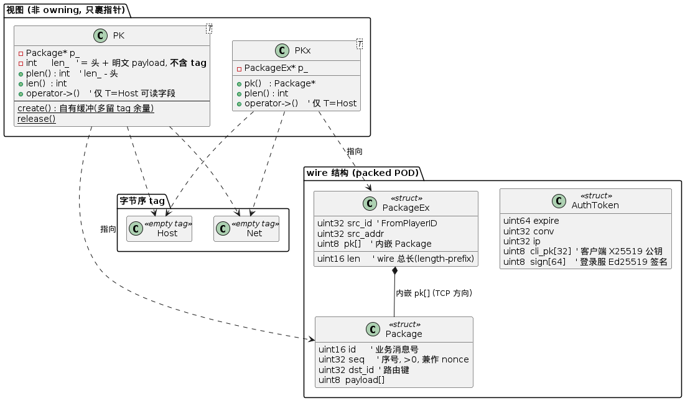
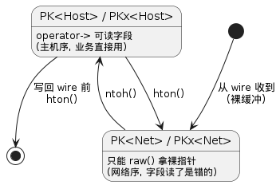

# 协议层 — `core::Package` / `core::PackageEx`

> 客户端 ↔ 网关 ↔ 后端 三段链路的应用层消息格式。所有多字节字段一律 **big-endian(网络序)**。
> 源码:[include/core/package.hpp](../include/core/package.hpp)

---

## 1. 两个方向、两种 wire frame

数据通道分两段,各用一种 wire:

| 段 | 传输 | wire | 长度怎么定 |
|---|---|---|---|
| 客户端 ↔ 网关 | KCP/UDP | 裸 `Package` | KCP 消息边界给定(**无长度字段**) |
| 网关 ↔ 后端 | TCP | `PackageEx` 内嵌 `Package` | `PackageEx.len`(2B length-prefix),后端 peek 2B 切包 |

```
KCP 方向 (Package, 客户端 ↔ 网关)
┌────────┬─────────┬───────────┬──────────────────┬──────────┐
│ id(2)  │ seq(4)  │ dst_id(4) │ payload ...       │ tag(16)  │
└────────┴─────────┴───────────┴──────────────────┴──────────┘
 │<──────── 头 10B (明文) ────────>│<── 密文 ──>│<─ Poly1305 ─>│
   · 头永远明文: 网关靠 dst_id 路由、seq 做 ChaCha20 nonce
   · payload 仅 authed 后加密, 尾部附 16B tag; 空 payload / 未 authed(握手) 包无 tag

TCP 方向 (PackageEx 内嵌 Package, 网关 ↔ 后端)
┌────────┬───────────┬────────────┬────────────────────────────┐
│ len(2) │ src_id(4) │ src_addr(4)│ pk[] = 完整 Package(明文)   │
└────────┴───────────┴────────────┴────────────────────────────┘
 │<──────── PackageEx 头 10B ──────>│<──── 内嵌 Package ───────>│
   · len = 整个 PackageEx wire 总长(length-prefix)
   · src_id = 网关从 conv 查到的 FromPlayerID(客户端无法伪造)
   · 内网可信, 不加密
```

---

## 2. 结构体与视图类型

`Package` / `PackageEx` / `AuthToken` 是 **packed POD**(贴 wire);`PK<T>` / `PKx<T>` 是**零开销的非-owning 视图** —— 只裹一个指针,带字节序 phantom-type。



**为什么要 `PK<T>` / `PKx<T>` 而不是直接用结构体指针:**
- **零拷贝**:视图只裹一个指针,指向 KCP/TCP 收缓冲里的原始字节,不复制。
- **字节序安全**:见下一节。

---

## 3. 字节序:phantom-type 强制(编译期防错)

wire 上是网络序,内存里要读字段得主机序。typhon 用 `Host`/`Net` 两个 **空 tag 类型**当模板参数,把"当前处于哪种字节序"编进类型:



- **只有 `T = Host` 时 `operator->()` / `pk()` / `plen()` 才编译得过**(SFINAE `enable_if`)。拿着 `PK<Net>` 想读 `->seq`?**编译报错**,而不是运行期读到大端乱值。
- `hton` / `ntoh` 是 `Host`↔`Net` 的**唯一转换入口**,内部调 `pk_hton`/`pk_ntoh` 翻头字段。全栈不再出现裸 `pk_hton` 散落各处。
- 开销:`PK<T>` 就俩字段(指针 + len),传值零成本;tag 类型不占空间。

---

## 4. 加密与"长度账"(`len_` 不含 tag)

ChaCha20-Poly1305 是 detached:密文与明文等长,外加 **16B Poly1305 tag**。typhon 的约定是:

> **`PK::len_` 永远 = 头 + 明文 payload,绝不含 tag。tag 只在 wire 传输那一瞬间存在**(send 末尾追加 / recv 开头剥离),不进任何视图的长度账。

- `PK::plen()` = `len_ - PKG_HDR_LEN` → 永远是明文 payload 长。
- `PK::create()` 给缓冲**多分配 `XX20_TAG_LEN`** 余量(给加密时写 tag 用),但 `len_` 只记逻辑长度。
- 收到加密包:`Session::recv` 解密后**剥 tag**,重建 `*pk` 让 `len_` 只到明文末尾。
- 发送加密包:`Session::send` 把密文+tag 加密**输出到独立暂存 buf**(不原地改入参缓冲),`ikcp_send` 发 `头 + 密文 + tag`。

这条约定消除了"长度到处 ±16"的混乱 —— 上层只跟明文长度打交道,tag 完全封装在 session 收发层。

---

## 5. 鉴权 token(`AuthToken`)

登录服(LOGIN)签发,客户端**只搬运不解密**:

- 登录服用**网关 X25519 公钥 `sealedbox` 加密** + **Ed25519 私钥签名**(签 `sign` 之前的字段)。
- 绑 `conv`:token 钉死一个 KCP conv,截获也无法异 conv 重放;`expire` 限时。
- 网关 `on_regist_req` 校验链:sealedbox 解密 → 验 `expire` → 验 `conv == s->conv()` → Ed25519 验签 → 用 token 内 `cli_pk` 做 X25519 ECDH 派生会话密钥。详见 [kcp_server.md](kcp_server.md)。

---

## 6. 关键常量与消息号

| 常量 | 值 | 含义 |
|---|---|---|
| `PKG_HDR_LEN` | 10 | `Package` 头(id 2 + seq 4 + dst_id 4) |
| `PKX_HDR_LEN` | 10 | `PackageEx` 头(len 2 + src_id 4 + src_addr 4) |
| `PKG_MAX_LEN` | 65535 | wire 总长上限(`PackageEx.len` 是 uint16) |
| `PKG_MAX_PAYLOAD` | 65509 | payload 上限,**取最严**:KCP 加密方向 `头10 + payload + tag16 ≤ 65535` |
| `XX20_TAG_LEN` | 16 | Poly1305 tag(见 [utils/cryptor.hpp](../include/utils/cryptor.hpp)) |

| 消息号 | 值 | 方向 | 含义 |
|---|---|---|---|
| `PKID_PING` / `PKID_PONG` | 100 / 101 | 双向 | 心跳 |
| `PKID_REGIST_REQ` / `PKID_REGIST_RSP` | 102 / 103 | 握手 | 鉴权注册 请求/应答 |

> `seq == 0` / `dst_id == 0` / `id == 0` 都视为非法包。`seq` 在 session 内单调递增,既做幂等去重,又当 ChaCha20 nonce 输入(保证 (key,nonce) 唯一)。
