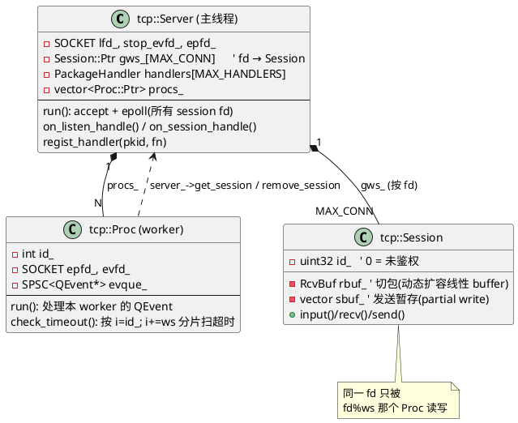
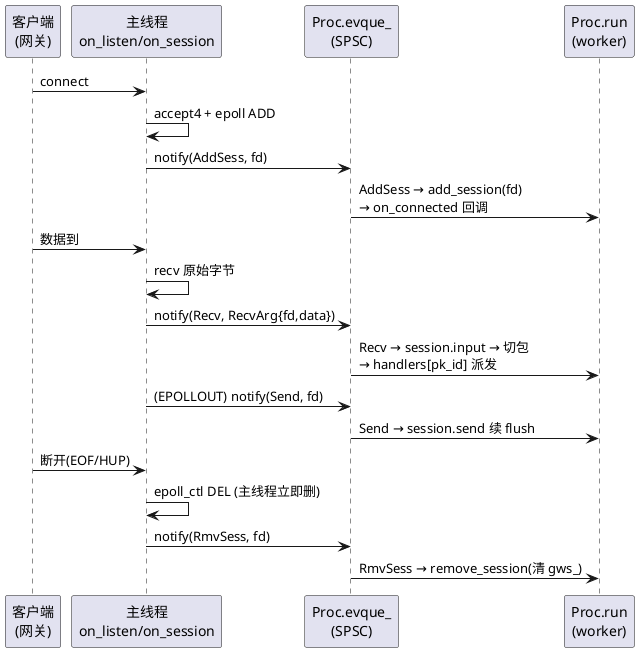
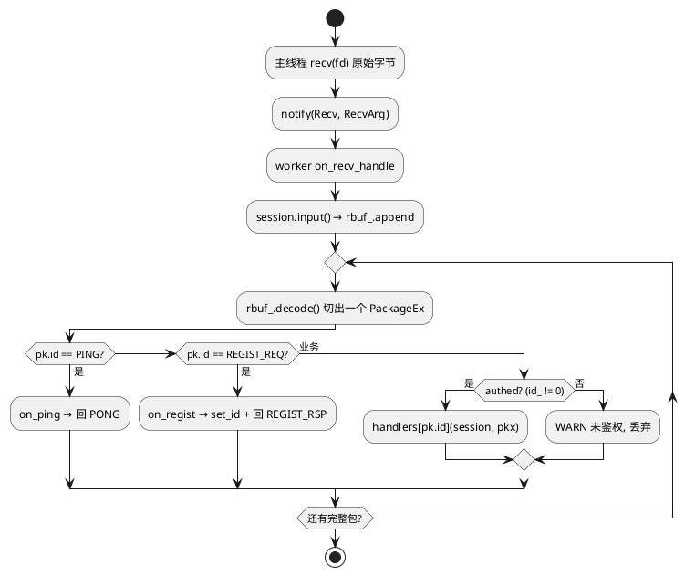
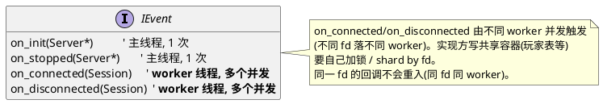

# `tcp::Server` — 后端业务服骨架

> 后端 instance 的 TCP 服务端。**只接网关连接**(不暴露给客户端,不存在远程攻击者 → 协议层 `ASSERT`-on-malformed 是合理的 fail-fast)。
> 主线程 `accept` + 收发,N 个 `Proc` worker 跑业务派发;同一 `fd` 始终落同一 worker(`fd % ws`)→ **session 不跨线程,无锁**。
> 源码:[include/tcp/server.hpp](../include/tcp/server.hpp) · [src/tcp/server.cpp](../src/tcp/server.cpp) · [src/tcp/proc.cpp](../src/tcp/proc.cpp)

---

## 1. 线程划分

**职责切分:**
- **主线程**:`accept` 新连接 + 把所有 session fd 放进自己的 epoll + `recv` 原始字节,然后**只 push 事件**给 worker,不碰业务。
- **Proc(worker)**:从 SPSC 队列取事件 → 切包 → 查 `handlers[]` 派发业务 → 发送 → 超时清理。`gws_[fd]` 只被对应 worker 读写。

---

## 2. 主线程 ↔ worker:统一事件队列

主线程通过 **SPSC 无锁队列 + eventfd 唤醒** 把四类事件投给 worker:

> `QEvent { Stop, Recv, Send, AddSess, RmvSess }` 抽在 [core/qevent.hpp](../include/core/qevent.hpp)。`Recv` 携带 `RcvArg{fd, len, data[]}`(mi_malloc,worker 处理后 free)。

---

## 3. 收包 → 业务派发

- `handlers[MAX_HANDLERS]` 是**裸数组,O(1) 派发**,**必须在 `run()` 之前 `regist_handler` 注册完**(运行中 worker 只读,无同步)。
- `RcvBuf`:lazy 分配,双游标 `rpos/wpos` + 阈值 `compact`;`decode` peek 2B `PackageEx.len` 切包,半包返回 `xAGAIN`。

---

## 4. `IEvent` 回调的线程语义(⚠️ 实现方注意)

---

## 5. session 生命周期与已知点

- **容器**:`gws_[fd]`(shared_ptr 数组,按 fd 索引,业务可跨调用安全持有,不会 UAF)。
- **超时**:worker `check_timeout` 每秒按 `i = id_; i += ws` 切片扫自己负责的 session,`last_recv_ms` 超时则 `remove_session`。
- **删除路径**:主线程检测断开(EOF/HUP)**立即** `epoll_ctl DEL`(EPOLLHUP 在 ET 下持续报,不立即删会空转)+ notify worker 清 `gws_`。
- **已知点(双重 DEL)**:主线程断开 DEL 与 worker `check_timeout` DEL 可能撞同一 fd → 第二次 `ENOENT`。当前用 **容忍 ENOENT** 处理(`epoll_ctl DEL` 失败若 `errno==ENOENT` 放过);更彻底的 "fd close/epoll 收同一线程" 因 fd 复用 ABA 留作 backlog。
- **release 顺序**:`procs_.clear()` 必须在 `threads_.join()` 之后(否则 worker 持有的 `this` 变 UAF)。
