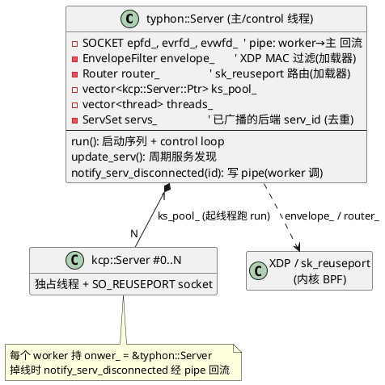
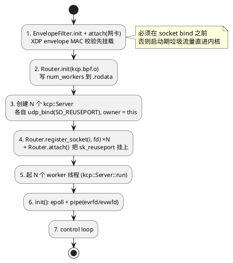
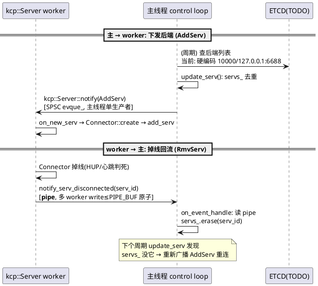
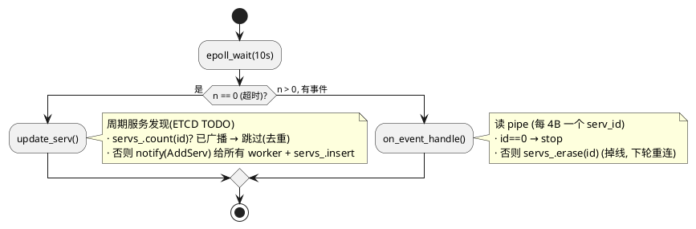
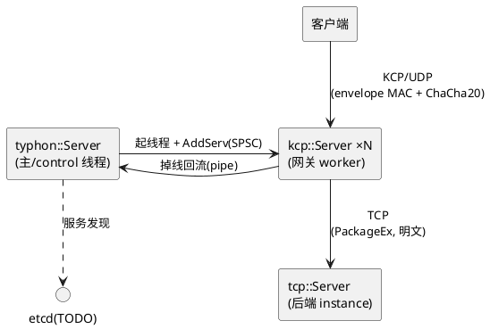

# `typhon::Server` — 顶层编排 + 控制面

> 整个网关进程的入口。负责:**装载 BPF(XDP + sk_reuseport)** → 起 **N 个 [kcp::Server](kcp_server.md) worker** → 跑**控制面 loop**(服务发现 + worker 掉线回流)。
> 它自己是单线程(主线程兼 control 线程),不碰数据面 —— 数据面在 N 个 worker 里。
> 源码:[include/typhon.hpp](../include/typhon.hpp) · [src/typhon.cpp](../src/typhon.cpp)

---

## 1. 进程结构总览

---

## 2. 启动序列(**顺序敏感**)

XDP 必须先于 socket bind 生效 —— "开机即受保护",启动期被攻击也挡得住:

> 析构顺序刚好相反:停 worker → join → 卸 BPF。`stop()` 把 `state_` 翻 `Stopping` 并 `notify(0)` 敲 pipe 唤醒主线程退出。

---

## 3. 控制面 loop + 双向事件通道

主线程 `epoll_wait(timeout = 10s)`:**超时(n==0)** 跑周期服务发现,**有事件(n>0)** 处理 worker 回流。两个方向用**不同通道**,各自满足单生产者:

| 方向 | 通道 | 为什么 |
|---|---|---|
| 主 → worker | SPSC `evque_` (kcp::Server 内) | 生产者只有主线程 `update_serv`,单生产者约束成立 |
| worker → 主 | **pipe** (`evrfd_`/`evwfd_`) | N 个 worker 都要写,`write ≤ PIPE_BUF` 天然原子,**不能用 SPSC**(多生产者违约);低频控制平面,不抠纳秒 |

---

## 4. 服务发现 + 重连(`update_serv`)

**重连风暴防护**:`update_serv` **只在 epoll 超时(n==0)分支跑**,不被掉线 pipe 事件即时驱动 —— 给重连一个 `INTERVAL_MS(10s)` 固定退避。否则 "断开 → notify → 立即重连 → 又断" 会把主线程钉成 busy-loop。

> **不做 Connector 层 TCP 自重连**(刻意):掉线即摘,重连统一由服务发现层 `update_serv` 周期重广播驱动 —— 把重连收敛到一处,不在每个 Connector 里写重试状态机。

---

## 5. 三个 Server 的关系一图收尾

- **数据面**:`客户端 →(KCP)→ kcp::Server →(TCP)→ tcp::Server`,反向对称。详见 [kcp_server.md](kcp_server.md) / [tcp_server.md](tcp_server.md)。
- **控制面**:`typhon::Server` 编排 worker 生命周期 + 后端服务发现。
- **协议**:三段都用 [Package / PackageEx](package.md)。
